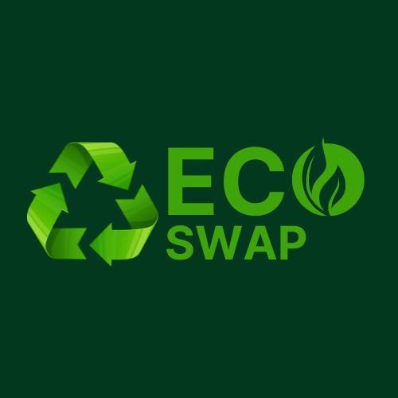

# Capstone Project - EcoSwap

<p align="center">
  
</p>

## 🌱 Gambaran Proyek

EcoSwap adalah Sebuah platform daur ulang yang berbasis online berguna untuk mempermudah masyarakat dalam menyalurkan limbah rumah tangga.

Tujuan kami adalah Mempermudah dalam Penyaluran Sampah: Memfasilitasi pengumpulan dan distribusi sampah daur ulang dari rumah tangga ke bank sampah. Meningkatkan Efisiensi Pengumpulan: Mengoptimalkan rute dan jadwal penjemputan untuk mengurangi waktu dan biaya operasional. Meningkatkan Partisipasi Masyarakat: Memotivasi lebih banyak orang untuk berpartisipasi dalam program daur ulang melalui kemudahan akses

Latar belakang proyek ini didorong oleh banyaknya permasalahan lingkungan yang semakin kompleks di Indonesia. Meningkatnya volume sampah, khususnya sampah plastik, telah menjadi ancaman bagi kelestarian lingkungan dan kesehatan masyarakat.
Pengelolaan sampah yang tidak tepat dapat menyebabkan pencemaran lingkungan, seperti pencemaran tanah, air, dan udara. Hal ini dapat berakibat pada berbagai penyakit dan gangguan kesehatan.
Di sisi lain, sampah juga memiliki potensi ekonomi yang dapat dimanfaatkan untuk meningkatkan kesejahteraan masyarakat. Sampah yang dikelola dengan baik dapat diolah menjadi berbagai produk bernilai ekonomis, seperti bahan baku kerajinan tangan, pupuk kompos, dan energi alternatif.

Pengembangan aplikasi web EcoSwap merupakan salah satu upaya inovatif untuk mengatasi permasalahan sampah dan meningkatkan nilai ekonomi sampah. Aplikasi ini diharapkan dapat mendorong partisipasi masyarakat dalam pengelolaan sampah yang berkelanjutan dan berkontribusi pada peningkatan kualitas hidup masyarakat dan kelestarian lingkungan.

## 🚀 Fitur Utama

- Pengajuan penjemputan sampah
- Penarikan point menjadi saldo E-Wallet

## 🛠️ Instalasi dan Penggunaan

### Prasyarat

- Node.js (versi 18 atau lebih baru)

### Langkah-langkah Instalasi

1. Clone repositori ini:
  ```sh
   git clone https://github.com/ainulrozi18/Front-End_EcoSwap.git
   ```
2. Masuk ke direktori proyek
  ```sh
   cd Front-End_EcoSwap
   ```
3. Instal dependensi:
   ```sh
   npm install
   ```
4. Jalankan aplikasi:
   ```sh
   npm run start-dev
   ```
5. Buka proyek di browser
   ```sh
   http://localhost:9090

## 👨‍💻 Pengembang

- [Muhammad Ainul Rozi Solichudin](https://github.com/ainulrozi18)
- [Sifaul Qolbi Saputra](https://github.com/SifaulQolbiSaputra)
- [Adib Jahfal Al Asyari]()
